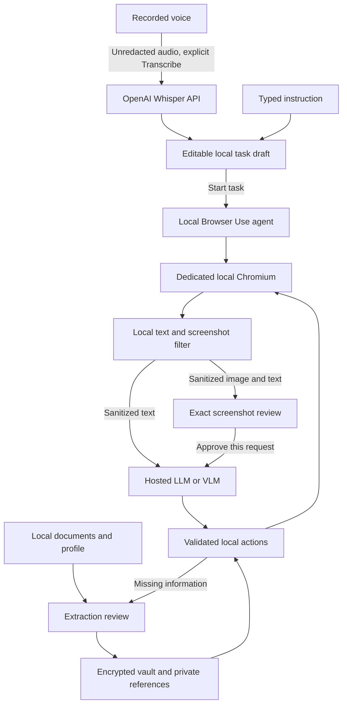

# Dev Privacy Guard

A supervised browser agent with a Chrome extension, local dashboard, encrypted profile, document intake, and human-reviewed screenshot sharing. **Browser Use runs the agent locally; a hosted LLM/VLM interprets sanitized context.**

Voice input uses **OpenAI Whisper (`whisper-1`)**. Audio is sent **unredacted** to OpenAI after the user chooses Transcribe. The returned transcript is an editable task draft; transcription never starts browser work automatically.

Follow the demo below from start to finish. **First-time installation:** [setup.md](setup.md). **Short startup reference:** [startup.md](startup.md). **Technical overview:** [How it works](#how-it-works).

## Demo: from instruction to a completed application

The demo uses the fictional **Meridian application portal**. You will start with only a name, email and phone number; ask the agent to open the website; review a redacted screenshot; supply a missing document; and resume to the final review page.

Use **Remote model** for this demonstration. You need a configured reasoning API key and a model that supports images and Chat Completions JSON output. The no-key **Demo planner** is a separate, simpler form fixture.

### 1. Start the app and unlock the dashboard

In Terminal:

```bash
cd /Users/aksh-aggarwal/Desktop/Workspace/SIH/Agent
./scripts/start.sh
```

Keep Terminal running and open [http://127.0.0.1:8765](http://127.0.0.1:8765).

Enter the pairing code printed in Terminal. Create a vault passphrase of at least 12 characters, or unlock your existing vault. Startup uses the existing Python environment and dashboard build; no test run is required.

The primary reasoning model defaults to **Gemini 2.5 Flash** (`gemini-2.5-flash`) using `https://generativelanguage.googleapis.com/v1beta/openai`. In **Settings → Reasoning provider**, select **Remote · Gemini / compatible provider**, enter your Gemini API key, then save. Existing encrypted provider settings still load when you unlock the vault; update the model and base URL above if you previously saved another provider. The transport uses [Google’s OpenAI compatibility API](https://ai.google.dev/gemini-api/docs/openai).

### 2. Open the controlled browser and extension

Choose **Launch browser** in the dashboard. Use the Chromium window that the app opens.

If the extension is not already loaded, open `chrome://extensions` in that window, enable **Developer mode**, choose **Load unpacked**, and select:

```text
/Users/aksh-aggarwal/Desktop/Workspace/SIH/Agent/apps/extension
```

Pin **Dev Privacy Guard**, open its side panel and pair with the same terminal code. Keep the dashboard available for screenshot review and document upload. You do not need to open the portal manually.

### 3. Prepare a deliberately incomplete profile

In the dashboard, open **New task** and choose **Prepare portal demo**. This saves synthetic contact records and selects only the name, email and phone for that draft. It also prepares the portal URL and task instruction.

For an **extension-led demonstration**, close this dashboard task draft without starting it. Open or reopen the extension side panel so it loads the saved records. In **Available information**, select only the synthetic name, email and phone. Leave PAN, address and statement total unselected, including any records left from earlier runs. The prepared dashboard draft is not automatically copied into the extension.

For a dashboard-led demonstration, keep the prepared draft open and continue there. Start only one task.

**What to show:** “The agent currently has access to three reviewed facts. The rest will come from a document supplied during the task.”

### 4. Give the agent its task

In your chosen interface, set the starting website to:

```text
http://127.0.0.1:8766/portal.html
```

Paste this instruction into the task box:

```text
Complete the fictional Meridian application using my selected profile. Fill the details you have, ask me for missing details or documents, then continue to the review step. Stop before final submission.
```

Use these options:

| Setting | Demo choice |
|---|---|
| Reasoning | Remote model |
| Available information | Synthetic name, email and phone only |
| Visual checkpoints | On |
| Also review text-only model requests | Off, to keep the demonstration moving |
| Stop before final submission | On |

Choose **Start task**. Watch the controlled browser open the portal, navigate and fill available details. Respond to action approvals if requested. The precise sequence depends on the model and page state.

**Optional voice opening:** first save the separate Whisper key in Settings. Use **Record voice task** in the extension or **Record task** in the dashboard, stop recording, and choose **Transcribe with Whisper**. Edit the text; in the extension, choose **Use transcript**. Then start the task explicitly. Say that the original audio is sent unredacted to OpenAI; only the later browser context goes through the privacy filter.

### 5. Demonstrate screenshot redaction and human approval

When the agent requests visual interpretation, it pauses before sending the image. In the extension, choose **Review image in dashboard ↗**.

In dashboard review:

1. Choose **Show local original** to compare the original screenshot with the redacted outgoing image.
2. Point out the covered filled values and the remaining page labels and layout.
3. Add a rectangle on the redacted preview to demonstrate human correction. Keep useful labels visible.
4. Choose **Apply masks & reload preview**. Wait for the updated preview; this replaces the pending image approval.
5. Expand **Outgoing text, destination & request hash** to inspect the accompanying request. The **Redaction report** provides mask details.
6. Choose **Approve image & continue** when satisfied. **Deny image send** blocks the request instead.

**What to show:** “The original is reviewed locally. This masked image is the one approved for the model. Changing the masks requires approval of the updated request.”

Approval remains disabled while a drawn mask has not been applied or the latest image is still loading. Every later screenshot request also needs review.

### 6. Supply the missing document

When the task asks for more information, open **Documents** in the dashboard, or use **Upload document ↗** from the extension.

Select this included file and choose **Upload locally**:

```text
/Users/aksh-aggarwal/Desktop/Workspace/SIH/Agent/demo/documents/portal-statement.txt
```

Review the extracted candidates. Select the missing facts and choose **Confirm selected fields**:

| Fact | Synthetic value in the document |
|---|---|
| PAN | ABCDE1234F |
| Address | 42 Sample Lane, Demo City |
| Statement total | 3050.00 |

The document also contains a name; avoid confirming a duplicate when the selected contact profile already supplies it. Keep the statement total scoped to the document. Choose profile scope for reusable details only if you want to retain them as general profile facts.

**What to show:** “Document extraction happens locally. I review the facts before they become available to the agent.”

### 7. Resume the same task

Return to the waiting task. In the extension, choose **Refresh reviewed information ↻**, then select the newly confirmed PAN, address and statement total along with the original contact records. Resume the task. In the dashboard's resume dialog, make the same selection and choose **Resume with selected fields**.

Uploading alone does not authorize new facts for the task; the resume selection matters. Continue approving any further screenshot requests.

Watch the agent fill the remaining fields and move toward the review page. Show the completed values in Chromium and the task activity in the dashboard or extension. Final submission should remain withheld by the selected policy.

**What to show:** “The model requests references; the local companion resolves their actual values when filling the website. The task continues with the newly reviewed information.”

### 8. Finish or repeat the demo

End the presentation on the completed form or review page without submitting. This is a fictional application, not a real ITR filing.

To repeat, start a new task with the portal URL and select only the three contact records again. **Prepare portal demo** makes that selection in a dashboard draft; if starting from the extension, select those three there yourself. Existing documents and records do not need to be deleted.

Press **Ctrl+C** in Terminal when finished using the app. On restart, use the new pairing code and unlock the vault again.

### If the demo pauses unexpectedly

| What you see | What to do |
|---|---|
| Remote model or preparation button unavailable | Save the reasoning provider settings first. |
| Task waiting at a screenshot | Open dashboard image review, apply pending masks, then approve the current request. |
| Task still asks for details after upload | Confirm the extracted fields, refresh available information, select those fields and resume. |
| No missing-document round | Start a new task with only name, email and phone selected. |
| Model/API error | Check the configured key, account credit, model and image support. Inspect the task and website before restarting. |
| Screenshot geometry cannot be verified | Let the page settle and follow the task's available recovery controls. An uncertain screenshot is blocked. |
| Pairing or connection error | Keep the companion terminal open and use its current pairing code. |

For the presentation, describe the visual filter as **DOM-based masking with human review**. Local ViT/CV and automatic face detection are not implemented. The selected values reach the destination website when filled, and Whisper receives raw audio when you choose transcription. Live model performance depends on the configured provider; the demo is supervised.

## What version 0.2 adds

- **Real Browser Use agent integration:** native agent planning and page observations, with a curated tool registry and controlled model adapter. Start from a URL without keeping the form open beforehand.
- **Selective screenshot masking:** local DOM geometry, known values and text patterns locate sensitive regions. Filled controls and uncertain media are covered with opaque pixels. Useful labels and layout remain visible where possible.
- **Screenshot review:** compare the original locally with the exact redacted outgoing image, add masks, and approve or deny. Edits replace the approval ID and request hash. Unapproved native screenshots are excluded from model calls.
- **Missing-information round trip:** request an approved visual interpretation, pause for documents or facts, then resume in the same browser tab with newly confirmed records.
- **Whisper dictation:** record, transcribe, edit, then explicitly start a task. Available from the dashboard and extension.
- **A fictional application portal:** a multi-step demonstration separate from the original deterministic form fixture.

This version intentionally **does not run a local ViT, browser CV model, or automatic face detector**. Its screenshot filter uses DOM signals, patterns and human corrections. It demonstrates part of the SIH problem statement; it does not establish complete compliance or universal PII detection.

## How it works



The extension and dashboard control an authenticated local Python companion. The companion runs pinned `browser-use==0.13.10`, stores reviewed facts, and mediates model requests and execution. It is not a cloud browser and does not run Python inside the extension.

The planner receives opaque references such as `ref_a1b2c3d4`, their labels and types. A custom `input_ref` tool resolves a reference immediately before filling the intended field. The resolved value is not placed in the model's action object or ordinary task events. **The destination website receives entered values**, potentially before submission.

For remote tasks, sanitized text planning is automatic unless text review is enabled. Every screenshot request requires human review. The agent has bounded step/call budgets and captures screenshots at explicit checkpoints rather than continuously uploading the screen. Final submission is withheld by the default task policy.

## Interfaces

| Surface | Purpose |
|---|---|
| Chrome extension | Enter a URL and task, dictate a draft, select reviewed information, monitor progress, pause/resume/stop, and open screenshot review. |
| Local dashboard | Manage the vault, review document facts, configure API keys, inspect outgoing requests and compare/redact screenshots. |
| Controlled Chromium | Runs the actual website task with a separate browser profile. |
| Fictional portal | Demonstrates navigation, partial profile filling, missing information and completion for review. No real tax filing. |

## Two execution modes

**Remote agent** uses Browser Use's stock agent with a real hosted model. It supports the navigation/document/screenshot workflow and requires an API key and a model that accepts images and Chat Completions JSON output. The wrapper removes unrestricted JavaScript, file/export/upload tools and literal private-value input paths. Additional actions can be added deliberately as their privacy boundaries are implemented.

**Local demo planner** preserves the original six-field fixture and deterministic field matching. It needs no API key and exercises the existing vault and execution approvals. It is explicitly labelled a rehearsal mode, does not use an AI planner, and is not the multi-step portal agent. Its legacy optional screenshot path remains completely masked.

## Data and privacy boundaries

- Profile records, original documents, confirmed facts and API credentials are encrypted in local SQLite using AES-GCM. A passphrase-derived key unlocks the vault; there is no cloud account or recovery service.
- Documents are extracted locally, including supported text PDFs, scanned PDFs, PNG/JPEG OCR, TXT and CSV. Candidates require review. Document-specific facts retain their scope unless the user chooses otherwise.
- Screenshot originals are transient local preview data. The model receives an immutable, verified masked PNG only through the reviewed image path. Manual masks are additive; changing an image requires a new approval.
- Page text, goals, tool results and model history pass through known-value/pattern sanitization. Unknown or unusual PII may be missed. Inspect context and mask uncertain regions before sharing sensitive pages.
- Browser Use cloud synchronization, telemetry, unguarded model fallbacks and raw screenshot/history persistence are disabled in the agent integration.
- **Audio is the explicit exception:** Whisper receives the original recording. Editing the transcript afterward does not remove that earlier disclosure. Recordings and transcripts are not automatically saved to the vault.
- Provider keys stay in the companion and encrypted vault, not frontend bundles or extension storage. Whisper has a separate OpenAI key setting from the configurable reasoning provider.
- Pairing authenticates each interface. The extension cannot read vault values or original screenshot previews; detailed image approval happens in the dashboard.
- Vault lock cancels active work and clears credentials and image artifacts. Restarted tasks remain stopped; no pending browser action is automatically replayed.

Ordinary Chromium cookies/cache, the destination website and operating-system backups are outside vault encryption. Local processing is not a guarantee against a compromised device.

## Project layout

```text
apps/dashboard/        React + TypeScript dashboard and review UI
apps/extension/        Chrome MV3 extension and recording surface
privacy_guard/
  api.py               Authenticated loopback API and local UI hosting
  tasks.py             Task lifecycle, approvals and reviewed record catalog
  agent_runtime.py     Browser Use Agent integration and restricted tools
  agent_llm.py         Sanitized agent-message transport
  browser.py           Dedicated Chromium/CDP connection and guarded execution
  privacy.py           Known-value and pattern text filtering
  privacy_geometry.py  Local DOM regions for masking
  screenshots.py       Immutable masked images and geometry validation
  audio.py             Bounded, unredacted Whisper transcription
  vault.py             Encrypted local records and documents
  documents.py         Local extraction, review and decimal calculations
  gateway.py           Legacy deterministic demo model gateway
demo/                  Fictional portal, original form and synthetic documents
tests/                 Privacy, transport, lifecycle and browser checks
scripts/               Setup, start and verification commands
startup.md             Daily startup, extension and portal demo instructions
```

## Development

```bash
./scripts/setup.sh
./scripts/start.sh
```

Run setup once for installation; on later launches, run only `./scripts/start.sh`. Startup uses the existing project Python environment and dashboard build without running tests or installing dependencies. Open `http://127.0.0.1:8765` and pair using the code printed in the terminal. Follow [startup.md](startup.md) for the launch and demo steps, or [setup.md](setup.md) for installation details.

```bash
./scripts/verify.sh
```

Verification uses synthetic data and mocked hosted responses where credentials are unavailable. A mocked provider test verifies integration and guards; it does not measure a real model's task success. See [docs/VALIDATION.md](docs/VALIDATION.md) for exactly what was exercised.

## Current scope

One user, one active task and one controlled Chromium tab. Starting from a URL opens the page and waits for its document to become ready before binding the agent to that exact tab; startup redirects use the resolved URL. Standard HTML forms, same-origin embedded forms, and controls in open shadow DOM are supported. Links requesting a new window stay in the task tab. Moving to another website origin during a task requires an in-app destination approval.

Remote mode reads locally verified field indices instead of forwarding Browser Use's native DOM text. Uninspectable frames are omitted from text context and masked in screenshots, so an unrelated iframe no longer blocks the whole page. Forms inside cross-origin frames, closed shadow DOM, login/CAPTCHA, some custom widgets, arbitrary file submission and complex tax calculations still need manual handling. Observations remain bounded to 12,000 DOM elements and 2,000 controls; rapidly changing pages can require fresh observations.

For browsing, give a specific public search phrase, for example: “Search for wireless headphones on this website and open a relevant product.” The `search_text` tool can enter a phrase from the task into a search box. Personal form values still use selected, reviewed records. Search/Next/Continue controls can proceed through the existing click review; final purchases and form submissions remain withheld by default. These capabilities are verified with synthetic Chromium fixtures, not a claim of universal Amazon or ITR portal compatibility. Firefox, browser-local CV, local speech inference and signed installers are future work.

The project reuses the MIT-licensed [Browser Use repository](https://github.com/browser-use/browser-use); its navigation and reasoning loop are upstream capabilities. The contribution here is the supervision, privacy gateway, local facts and document workflow. The audio integration follows the [OpenAI transcription API](https://developers.openai.com/api/docs/guides/speech-to-text).

The [original implementation plan](IMPLEMENTATION_PLAN.md) is historical. The [v0.2 implementation record](docs/IMPLEMENTATION_V0_2.md) describes the revised scope.

### Optional OpenAI fallback

Gemini 2.5 Flash remains the primary model. In Settings, save a separate OpenAI key under **Optional fallback · OpenAI** (default model: `gpt-4.1-mini`). Without that key, no fallback is attempted. A remote agent task switches once to OpenAI after a connection failure or HTTP 400/401/403/404/408/429/5xx. It stays on OpenAI for the rest of that task; new tasks begin with Gemini. Redirects, privacy-check failures and invalid model output do not trigger fallback.

Text review, when enabled, is repeated for the changed destination. Images always require fresh review for OpenAI, including any updated masks. Keys stay encrypted locally and the Whisper key is never reused automatically. Restart the companion after updating the code, then save the keys in the unlocked Settings page.

### Backend diagnostic logs

Start the backend normally with `./scripts/start.sh`. It writes JSON logs to the
terminal and `$GUARD_DATA_DIR/logs/backend.log` (default:
`~/Library/Application Support/Dev Privacy Guard/logs/backend.log`). Files rotate
at 5 MB, retaining three backups. Restart the backend after changing logging settings.

```bash
# Include successful GET requests, such as dashboard polling:
GUARD_LOG_LEVEL=DEBUG ./scripts/start.sh

# Watch the default log location:
tail -f "$HOME/Library/Application Support/Dev Privacy Guard/logs/backend.log"
```

The default level is `INFO`; `WARNING`, `ERROR`, and `CRITICAL` are also supported.
Use the response's `X-Request-ID` header to find matching API logs. Background
operations include a task ID; browser and model operations record timings,
provider HTTP status, fallback attempts, and failures. Successful GET requests
are logged only at `DEBUG` to keep polling noise low.

Errors include exception types and stack file/function/line locations. Logs omit
exception messages, source lines, local variables, request bodies, headers,
query strings, page content, and model payloads to protect vault data and keys.
Task events record status and step metadata; their text remains in the dashboard.
Third-party verbose logging remains disabled. Logging is configured by the normal
backend entry point (`privacy-guard` or `python -m privacy_guard.main`).

### Dropdown compatibility

Native single-choice dropdowns support private-reference matching by option value
or label, with a fallback for capitalization and whitespace differences. When
several options share a value (as on the Protean PAN application form), the agent
can use `select_option` with the exact observed option index. The dashboard asks
you to review that choice before applying it. Unknown personal choices still need
user input; the agent must not guess them.

A missing or ambiguous match leaves the control unchanged and lets the agent
inspect fresh options or request help. It no longer reports an uncertain action
for that rejection. Disabled options and disabled option groups are excluded;
selection is verified after input/change handlers run. Custom dropdowns use the
existing visible-control click workflow. This improves compatibility across
forms, but does not guarantee every website: inaccessible controls, login/CAPTCHA,
file-upload requirements and unsupported widgets may still need manual help.
After updating, restart the backend and start a fresh task for an already-ended
`option_not_unique` failure.
