# Dev Privacy Guard — Technical Flowchart

Target architecture for the complete product. Each of the four boxes from the rough layout is expanded into its internal processing flow. Browser-local CV and cache reuse are planned capabilities, not claims about the current demo.

```mermaid
flowchart LR
  subgraph VAULT["1 · PROFILE VAULT — LOCAL"]
    V1["Profile details + documents"] --> V2["Local parsing / OCR<br/>Review extracted facts"]
    V2 --> V3[("Encrypted SQLite vault<br/>AES-GCM · versioned records")]
    V3 --> V4["Task-scoped references<br/>ref_7 → private value"]
  end

  subgraph TASK["2 · START TASK — LOCAL"]
    T1["MV3 extension · React / TypeScript<br/>Goal + URL + selected references"]
    T1 --> T2["FastAPI companion + Browser Use<br/>Open website · bind exact tab"]
    T2 --> T3["Observe DOM / ARIA + screenshot<br/>Track page version and changes"]
  end

  subgraph REDACT["3 · REDACTION ENGINE — IN BROWSER"]
    R1["Change detection + local cache<br/>Reuse valid regions · refresh changed areas"]
    R1 --> R2["DOM rules + patterns<br/>Credentials · known PII"]
    R1 --> R3["Local CV + OCR + face detection<br/>ONNX Runtime Web · WebGPU / WASM"]
    R2 --> R4["Merge detections + confidence policy<br/>Mask pixels · sanitize text and URLs"]
    R3 --> R4
    R4 --> R5{"Review exact outgoing<br/>screenshot + context"}
    R5 -->|Edit masks| R4
    R5 -->|Approve| R6["Privacy gateway<br/>Bind payload hash + provider"]
  end

  subgraph ACTION["4 · LLM ACTION FOR AGENT"]
    A1["REMOTE · LLM / VLM<br/>Sanitized context + reference labels only"]
    A1 --> A2["Structured response<br/>Action / input_ref / missing information"]
    A2 --> A3{"LOCAL · Validate response<br/>Target · page version · permissions"}
    A3 -->|Missing details| A4["Pause · ask user<br/>Upload document or enter detail"]
    A3 -->|Allowed routine action| A5["Resolve references locally<br/>Execute via guarded Browser Use / CDP"]
    A3 -->|Submit / pay / consequential| A6{"Explicit final approval"}
    A6 -->|Approve| A5
    A6 -->|Decline| A7["Stay paused"]
    A3 -->|Invalid or stale| A8["Block action · re-observe"]
    A5 --> A9{"Verify result locally"}
    A9 -->|Complete| A10["Report completion"]
  end

  V4 -->|IDs + labels only| T1
  T3 --> R1
  R6 -->|Sanitized payload only| A1
  V4 -.->|Authorized local lookup| A5
  A4 -->|Review and update facts| V2
  V2 -.->|Resume same task| T3
  A8 --> T3
  A9 -->|More steps| T3

  classDef local fill:#e4efff,stroke:#5779b8,color:#15253f;
  classDef privacy fill:#eee7ff,stroke:#8a69c4,color:#30204c;
  classDef human fill:#ffe4eb,stroke:#c77b94,color:#4a2432;
  classDef cloud fill:#fff3c9,stroke:#c69b3b,color:#493914;
  classDef done fill:#dcf6e6,stroke:#5fa67c,color:#21432e;
  class V1,V2,V3,V4,T1,T2,T3,A2,A3,A5,A8,A9 local;
  class R1,R2,R3,R4,R6 privacy;
  class R5,A4,A6,A7 human;
  class A1 cloud;
  class A10 done;
```

Model candidates from the full plan: MobileViT or equivalent for local visual understanding, MediaPipe or TinyFaceDetector for faces, and a browser-compatible OCR pipeline. Exact checkpoints and runtime compatibility remain to be validated. A hosted LLM/VLM supplies remote reasoning.

Private values and raw visual features remain local to the processing pipeline. Authorized values reach the destination website when entered; they are not included in the reasoning payload. Every screenshot transmission requires exact-payload review. Invalid actions are blocked; missing information and final approvals pause the task.

See [the full technical plan](../REAL_TECHNICAL_PLAN.md) for module details, model candidates and evaluation requirements.
